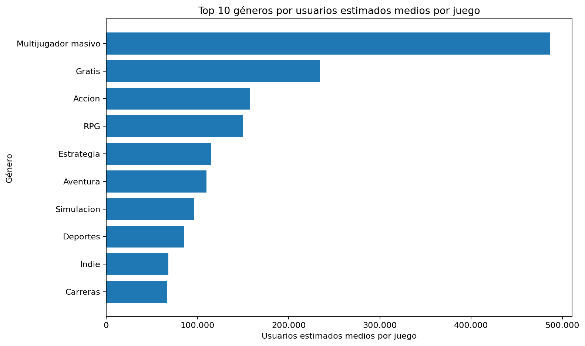
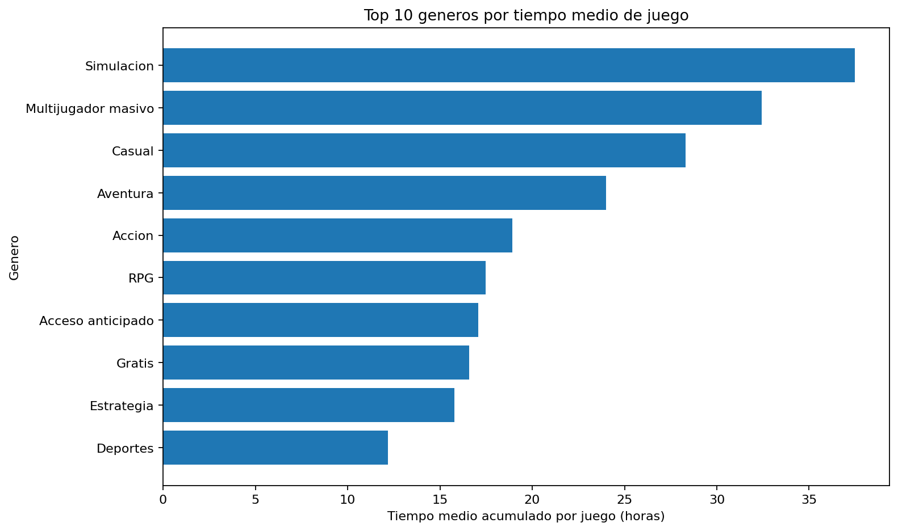
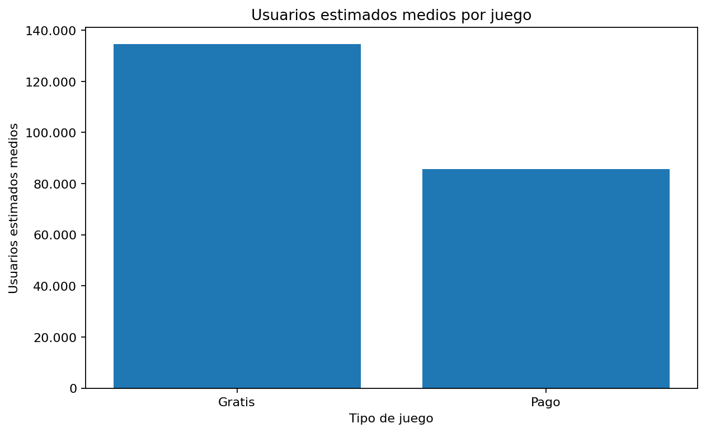
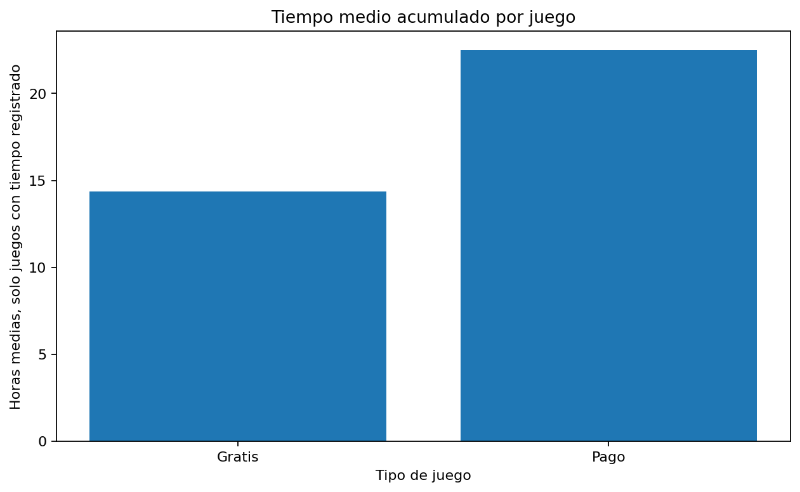
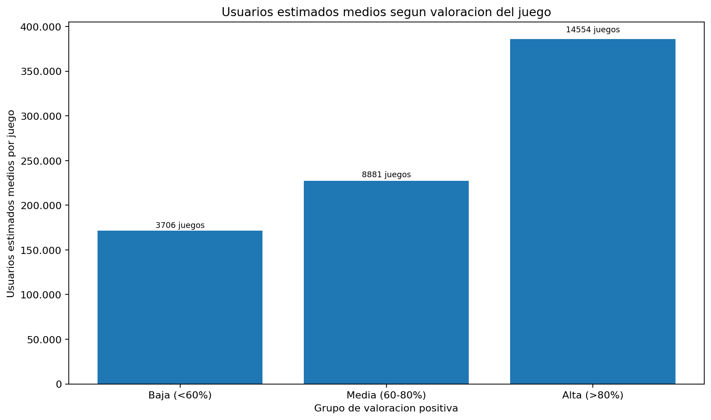
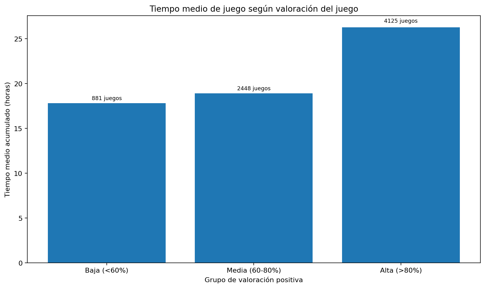

# Proyecto Steam Games 2025

Este proyecto es un análisis de datos sobre videojuegos publicados en Steam. Lo he desarrollado como proyecto académico del **Master en Data Science de Evolve**.

La idea principal era trabajar con un dataset real, limpiarlo, transformarlo y sacar conclusiones comprensibles a partir de los datos. Elegí este dataset porque Steam es una plataforma muy conocida y porque los videojuegos me parecían un tema interesante para practicar análisis exploratorio.

## Pregunta principal

La pregunta inicial del proyecto fue:

> ¿Qué géneros tienen más usuarios estimados por juego y cuáles tienen mayor tiempo medio de juego?

Durante el análisis añadí dos preguntas más:

- ¿Hay diferencias claras entre juegos gratuitos y juegos de pago?
- ¿Existe relación entre valoraciones positivas, usuarios estimados y tiempo medio de juego?

## Dataset utilizado

El dataset utilizado es **Steam Games dataset 2025**, descargado de Kaggle.

El archivo original esperado es:

```text
data/raw/games_march2025_full.csv
```

El dataset original contiene aproximadamente **95.000 juegos** y **47 columnas**.

El CSV original no está incluido en este repositorio porque pesa demasiado para GitHub. Para reproducir el proyecto hay que descargarlo desde Kaggle y colocarlo en la carpeta `data/raw/` con el nombre `games_march2025_full.csv`.

## Tecnologías utilizadas

- Python
- pandas
- matplotlib
- Jupyter Notebook
- PowerShell
- Markdown
- HTML

## Estructura del repositorio

```text
Steam_Games_2025/
|-- data/
|   |-- raw/
|   |   |-- README.md
|   |   `-- games_march2025_full.csv
|   `-- processed/
|       |-- juegos_steam_limpio_base.csv
|       |-- resumen_generos.csv
|       `-- resumen_generos_min_1000_juegos.csv
|-- notebooks/
|   |-- 01_analisis_generos.ipynb
|   |-- 01_analisis_generos_ejecutado.ipynb
|   |-- 02_gratis_vs_pago.ipynb
|   |-- 02_gratis_vs_pago_ejecutado.ipynb
|   |-- 03_valoraciones_popularidad.ipynb
|   `-- 03_valoraciones_popularidad_ejecutado.ipynb
|-- reports/
|   |-- figures/
|   |-- entrega/
|   |-- informe_final.md
|   |-- informe_final.html
|   |-- presentacion_resumen.md
|   |-- publicacion_devto.md
|   |-- medium_hashnode.md
|   |-- linkedin_article.md
|   |-- linkedin_post.md
|   `-- checklist_publicacion_evolve.md
|-- scripts/
|   `-- run_all.ps1
|-- src/
|   |-- analyze_genres.py
|   `-- create_figures.py
|-- requirements.txt
`-- README.md
```

## Cómo ejecutar el proyecto

Primero hay que crear y activar un entorno virtual:

```powershell
python -m venv .venv
.\.venv\Scripts\Activate.ps1
```

Después se instalan las dependencias:

```powershell
pip install -r requirements.txt
```

Para ejecutar todo el proyecto:

```powershell
.\scripts\run_all.ps1
```

Este script ejecuta la limpieza de datos, genera las gráficas y crea versiones ejecutadas de los notebooks.

## Archivos principales

- `src/analyze_genres.py`: limpia el dataset original y genera los CSV procesados.
- `src/create_figures.py`: genera las gráficas utilizadas en el informe.
- `notebooks/01_analisis_generos.ipynb`: análisis de géneros.
- `notebooks/02_gratis_vs_pago.ipynb`: comparación entre juegos gratuitos y de pago.
- `notebooks/03_valoraciones_popularidad.ipynb`: análisis de valoraciones, usuarios y tiempo medio.
- `reports/informe_final.md`: informe final del proyecto.
- `reports/informe_final.html`: versión HTML del informe.
- `reports/entrega/Analisis_Steam_2025_Generos_Usuarios_Valoraciones.pdf`: PDF final preparado para entregar.

## Limpieza y transformación de datos

Durante el proyecto hice varias transformaciones importantes:

- Convertí `estimated_owners` en una estimación numérica usando el punto medio del rango.
- Convertí `average_playtime_forever` de minutos a horas.
- Separé los géneros para poder analizarlos individualmente.
- Traducí los géneros principales al castellano para que el informe fuera más claro.
- Filtré algunos análisis para evitar resultados poco representativos.
- Generé tablas resumen por género y por tipo de juego.

Una de las decisiones más importantes fue usar **usuarios estimados medios por juego** en lugar de usuarios acumulados por género. Al principio los totales daban cifras demasiado grandes, porque un mismo juego puede aparecer en varios géneros. Para comparar mejor los géneros, la media por juego era una métrica más razonable.

## Resultados principales

### Géneros con más usuarios estimados medios por juego

Entre los géneros con al menos 1.000 juegos, los que tienen más usuarios estimados medios por juego son:

| Género | Usuarios estimados medios por juego |
|---|---:|
| Multijugador masivo | 486.198 |
| Gratis | 233.896 |
| Acción | 157.349 |
| RPG | 150.048 |
| Estrategia | 114.714 |



### Géneros con mayor tiempo medio de juego

Los géneros con mayor tiempo medio de juego son:

| Género | Tiempo medio |
|---|---:|
| Simulación | 37,47 horas |
| Multijugador masivo | 32,42 horas |
| Casual | 28,32 horas |
| Aventura | 23,99 horas |
| Acción | 18,92 horas |



### Juegos gratuitos frente a juegos de pago

| Tipo de juego | Usuarios medios | Tiempo medio | Valoraciones positivas |
|---|---:|---:|---:|
| Gratis | 134.488 | 14,37 horas | 75% |
| Pago | 85.688 | 22,49 horas | 75% |

Los juegos gratuitos tienen más usuarios estimados medios, pero los juegos de pago tienen más tiempo medio de juego.





### Valoraciones, usuarios y tiempo medio

Para analizar las valoraciones filtré los juegos con al menos 50 reseñas. Hice esto porque un juego con muy pocas reseñas puede tener un porcentaje positivo muy alto o muy bajo sin que sea realmente representativo.

En este análisis no aparece una relación fuerte entre tener mejores valoraciones y tener más usuarios estimados o más tiempo medio de juego.





## Conclusiones

La primera conclusión es que popularidad y tiempo de juego no son exactamente lo mismo. Un género puede tener muchos usuarios estimados por juego, pero no necesariamente ser el que más horas acumula de media.

La segunda conclusión es que los juegos gratuitos parecen llegar a más gente, pero los juegos de pago tienen más tiempo medio de juego. Mi interpretación es que los juegos gratis reducen la barrera de entrada, mientras que en los juegos de pago puede haber más intención de jugar durante más tiempo porque el usuario ya ha pagado por ellos.

La tercera conclusión es que las valoraciones positivas no explican por sí solas la popularidad. Hay juegos bien valorados con pocos usuarios y juegos con muchos usuarios que no necesariamente tienen las mejores valoraciones.

## Limitaciones del análisis

Este proyecto tiene algunas limitaciones importantes:

- `estimated_owners` no da usuarios exactos, sino rangos.
- La estimación de usuarios se calcula usando el punto medio de cada rango.
- Un mismo juego puede pertenecer a varios géneros.
- El tiempo medio de juego puede aparecer como 0 en muchos juegos.
- Las valoraciones pueden ser poco fiables cuando hay pocas reseñas.
- Correlación no significa causalidad.

Estas limitaciones no invalidan el análisis, pero sí ayudan a interpretar los resultados con cuidado.

## Qué he aprendido

Con este proyecto he practicado todo el flujo básico de un análisis de datos:

- elegir una pregunta de análisis;
- entender el dataset;
- limpiar y transformar datos;
- crear nuevas variables;
- generar tablas resumen;
- crear visualizaciones;
- revisar si los resultados tenían sentido;
- explicar las conclusiones de forma clara.

También aprendí que en análisis de datos no basta con que el código funcione. Hay que comprobar si los resultados son razonables. En este proyecto, por ejemplo, al principio salían cifras de usuarios demasiado grandes, y eso me obligó a revisar la métrica que estaba usando.

## Entregables

El proyecto incluye:

- notebooks de análisis;
- scripts de limpieza y generación de gráficas;
- CSV procesados;
- informe final en Markdown;
- informe final en HTML;
- PDF final;
- borradores para publicación en Dev.to, Medium/Hashnode y LinkedIn.

## Publicación

Repositorio:

```text
https://github.com/DaniSanchezDevx/Proyecto-Master-DataScience-Evolve-Daniel-Sanchez-Moares
```

Nombre del repositorio según la guía de publicación:

```text
Proyecto-Master-DataScience-Evolve-Daniel-Sanchez-Moares
```

Proyecto académico desarrollado durante el **Master en Data Science de Evolve**.
